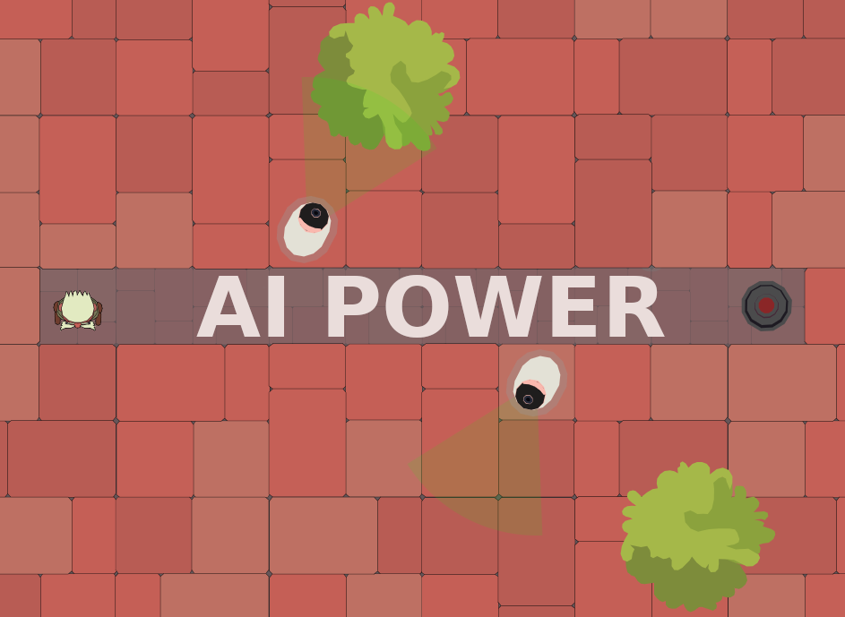

# AI Power (Game)

Minimalistic game to participate in the gamedevjs contest (2024).

[]()

[game demo deployed in github](https://inflagames.github.io/ai-power/)

## Develop mode

You can start the project in develop with the command `npm start`. This has live reloading after any change in the code.

> **Note**: after start the project, it can be opened via [localhost:9000](http://localhost:9000)

## Build project

To build the project in production and generate the *game.zip* file, you only need to run the command `npm run build`.

> **Note**: the build script generate the *./dist* folder and at the same time it compress automatically the game in the *ai-power.zip* file.

## Run tests

```
npm test
```

## Author(s)

- [wil92](https://github.com/wil92)

## Contributions

All contributions are welcome.

## License

[LICENSE](./LICENSE.md)
